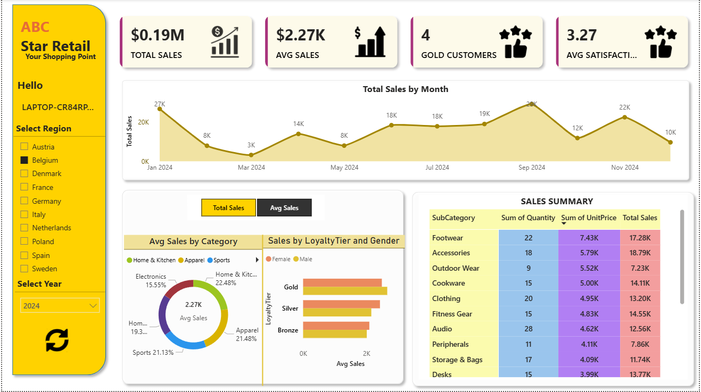

# ABC Star Retail Dashboard

Interactive retail analytics dashboard developed using Power BI.

## Features
- Total Sales KPI
- Average Sales Analysis
- Customer Segmentation
- Monthly Sales Trends
- Loyalty Tier Analysis
- Regional Filtering

## Tools Used
- Power BI
- DAX
- Power Query
- CSV Datasets

## Dashboard Preview

## Dataset Files
- Customers Data
- Sales Data
- Product Information
- Employee Data
- Feedback Data
- Calendar Data

## Project Insights
- Identified high-performing product categories
- Analyzed customer loyalty trends
- Compared regional sales performance
- Built interactive KPI cards and slicers
